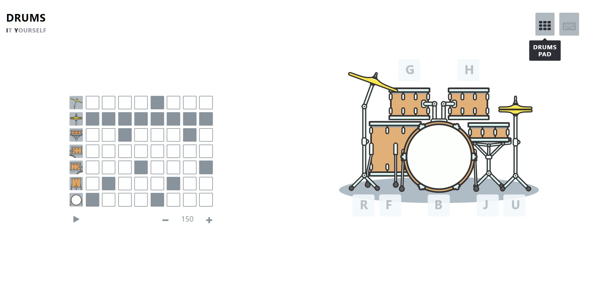

# Drums-It-Yourself

Interactive Drums 
Learn how to play drums and make your own beat
 
         

 
<a href="https://houssemlachtar.github.io/Drums-It-Yourself/">
        Demo
    </a>

## Used Tools

  
Used Libraries

  

1. [JQuery](https://jquery.com).
2. [Font Awesome](https://fontawesome.com).      

  
Softwares

  

1. [Adobe Illustrator](https://www.adobe.com): to sketch the drums.        

## Responsive ✔️

## Follow me on

[Instagram](https://www.instagram.com/houssem_lachtar/), [Codepen](https://codepen.io/houssem-lachtar), [GitHub](https://github.com/houssemlachtar)
